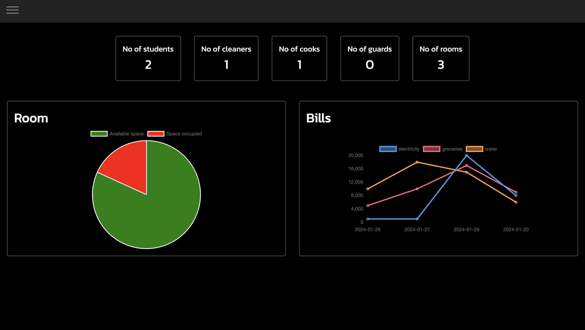
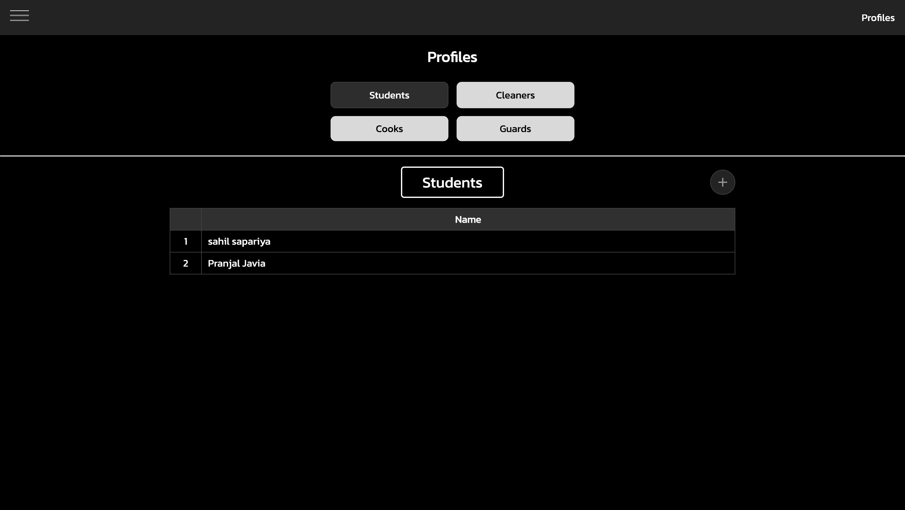

# Hostel Management System

Welcome to the Hostel Management System! This web application streamlines hostel operations, providing a centralized platform for managing students, staff, mess, and various administrative tasks.

## Table of Contents

- [Features](#features)
- [Installation](#installation)
- [Usage](#usage)
- [Visuals](#visuals)
- [Contributing](#contributing)

## Features

### 1. Student Management

- Record student details, including personal information.
- Allocate and track rooms, manage room occupancy, and handle room vacancies.

### 2. Staff Management

- Manage details of cleaning staff, cooking staff, and other personnel.

### 3. Financial Management

- Generate bills and invoices for students based on their chosen meal plans and transactions.

### 4. Room Management

- Manage details of each room including the students associated with the room.
- Admin can manage the records of the room including the facilities that room provides

## Installation

1.  **Clone the Repository:**

    ```bash
    git clone https://github.com/your-username/hostel-management.git
    ```

2.  **Navigate to the Project Directory:**

    ```bash
    cd hostel-management
    ```

3.  **Install Dependencies:**

    > For installation of client dependencies

    ```bash
    cd client
    npm install
    ```

    > For installation of server dependencies

        ```bash
        cd server
        pip install -r requirements.txt
        ```

4.  **Run the Application:**
    If you have setup for the make command then use the below command it will automatically type the required commands

    ```bash
    make
    ```

    Otherwise you have to run client and server manually using

    _Terminal 1_

    ```bash
    cd client
    npm start
    ```

    _Terminal 2_

    ```bash
    cd server
    python manage.py runserver
    ```

5.  **Access the Application:**
    - Open a web browser and go to `http://localhost:3000`.

## Usage

1. **Login:**

   - Use your admin credentials to log in to the system.
   - For demo purposes here use this credentials: 
        > - **Username: admin**
        > - **Password: password@123**

2. **Navigate Dashboard:**

   - Explore the dashboard for an overview of hostel activities.

3. **Manage Students:**

   - Add, update, or remove student records.
   - Allocate rooms and track occupancy.

4. **Staff Management:**

   - Add and manage details of cleaning staff, cooking staff, etc.

5. **Financial Management:**

   - Track and manage financial transactions and invoices (bills).


## Visuals

### Home Screen



### Profile Screen




## Contributing

If you'd like to contribute to the project, please follow these guidelines:

1. Fork the repository on GitHub.
2. Clone your forked repository (`git clone https://github.com/your-username/hostel-management.git`).
3. Create a new branch for your feature or bug fix (`git checkout -b feature-name`).
4. Make your changes and commit them (`git commit -am 'Add feature'`).
5. Push to the branch (`git push origin feature-name`).
6. Create a new Pull Request on GitHub.